# RRT* 

We will first discuss how RRT* operates. It is much similar in comparison to RRT. The algorithm starts by building a tree using random samples from the robot’s operating space and adds new samples to the tree. However, there are two notable differences with respect to RRT:
1.	New edge addition 
2.	Additional step to optimize path cost through rewiring 

Below is the pseudo code for RRT*. Each step of the code is discussed in detail later. 

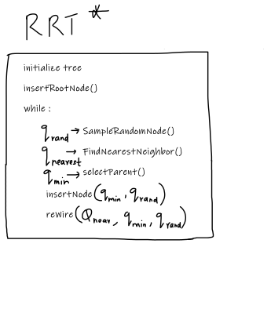

The algorithm begins by sampling a random node in the robot’s configuration space. A nearest node to the randomly sampled node is selected from the existing tree. The random node and its nearest node in the tree are selected to select an optimal parent node for the random node to be added to the tree. The cost to reach the random node through the nearest node is used as a starting point in the optimization. 

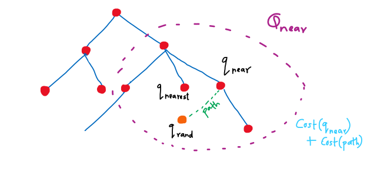

***

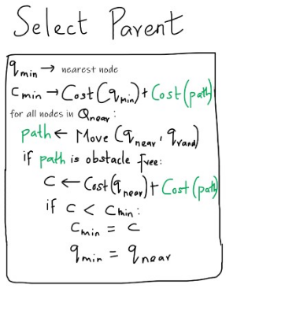
 
The algorithm searches for all nodes within a boundary near the new node and selects the node that has minimum cost to reach the random node. One condition while looping through the nodes is that the potential path has to obstacle free. 

After choosing the most optimal parent for the random node, it is inserted into the tree. RRT* further optimizes the tree structure by employing rewiring, as discussed below. 
The algorithm starts again by considering candidate nodes out of the boundary near the newly added node. For every nearby node in the boundary, a path is drawn starting from the newly added node to the nearby node (opposite to how the path was drawn in the algorithm for choosing parent). If the path is obstacle free and the total cost of this path is lower than the current cost to nearest node, the newly added random node is a better parent than the current parent of the nearest node. Rewiring is done to reflect this change in the parent. The optimization step of the algorithm is shown below. 
 
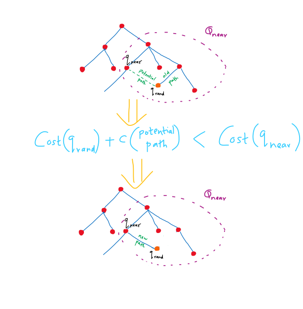

This completes one step of the RRT* algorithm. That is, adding new nodes to expand the tree. As the tree expands and its nodes reach nearer to the goal location through expanding, the iteration is stopped. RRT* in action is shown below. 


The dark green circles are static obstacles. The bright green circles are start and goal nodes. Notice how the tree doesn’t expand into the obstacles. The optimal path from source to the goal is selected.

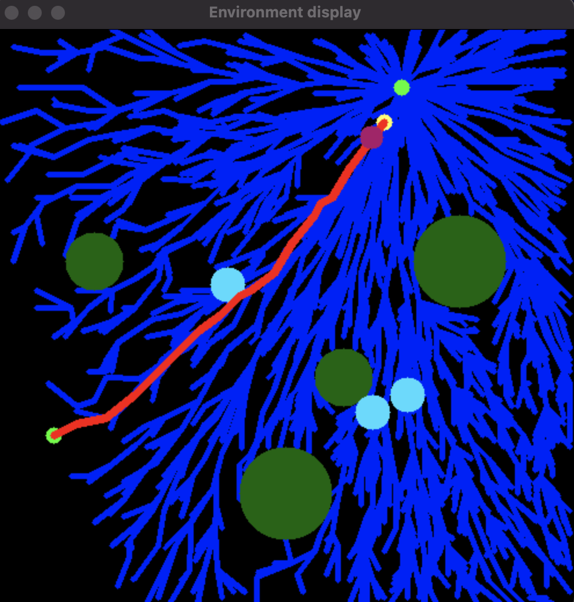 

The light blue circles are dynamic or moving obstacles. The robot starts on the selected path highlighted in RED. This is a good time to look at how the software components work and interact with each other. To make the robot move along the path towards goal and at the same time be able to handle collision with dynamic obstacles while having the freedom to visualize every bit of what’s happening with the robot motion, we run three threads as below:
 
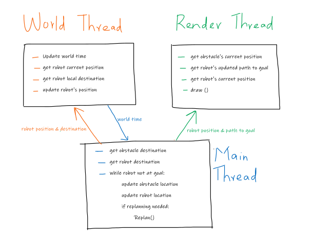


1.	World thread: 
     * Maintains the state of the world (clock)
     * Reads robot’s current position 
     * Reads robot’s next local destination
     * Based on the above two, sets the destination of the robot (moves it along the best path)

2.	Render thread 
     * Reads robot’s current position 
     * Reads dynamic obstacle’s position 
     * Renders the robot, dynamic obstacles, static obstacles and the robot’s path towards goal 
3.	Main thread 
     * Checks for robot’s collision with dynamic obstacles 
     * If needed, does the path re-planning around the obstacle 
     * Updates the re-planned path 

Robots operating in the real world have sensors to detect the obstacles. For this study, we ignore the sensors and instead place a threshold range and when the dynamic obstacle is within the threshold range and the some other conditions (discussed next) are satisfied, re-planning algorithm is triggered in the main loop to allow for navigating the obstacle. 

# Path re-planning 

The robot starts moving along the optimal path generated in the first part of this discussion. Re-planning begins with the determination of whether of not the moving obstacle is blocking the path. There are multiple possibilities while determining whether the dynamic obstacle blocks the robot’s path. 

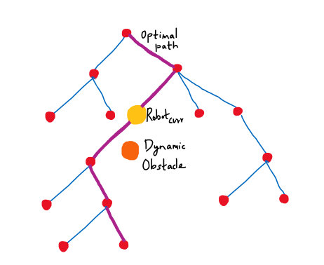


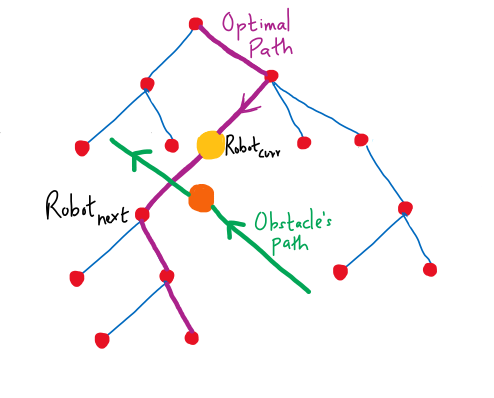

 
Let’s zoom in near the robot’s current position. The purple trajectory is robot’s current optimal path towards the goal. The green trajectory is the dynamic obstacle’s path. We mark the robot and obstacles current and next location. 
 

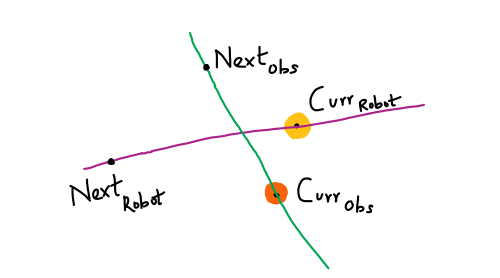


The first condition to check is if the distance between obstacle and robot is less than the sum of robot’s and obstacles radii. Both at obstacle’s current location and the next location. 
That is, 

```
**A** < (Sum of radii of robot and obstacle) OR **B** < (Sum of radii of robot and obstacle)
```

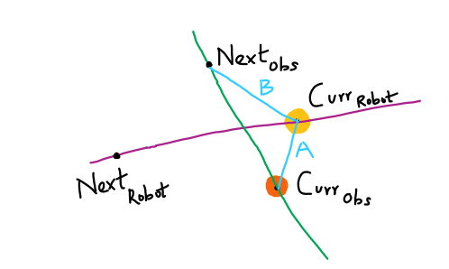


If the above condition is true, then there is clearly a collision about to occur. Next, we check for the cosine of angles to the end points of the obstacles motion from robot’s current position. If any of those angles is greater than 90, we know for sure the obstacle is not going to cut through the robot’s path at least for the current time step. 

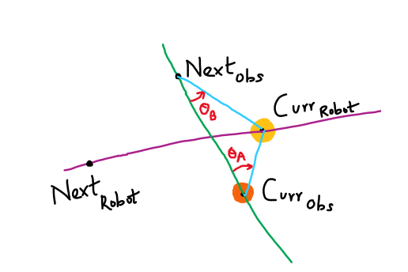
 
If not, we also check, if the minimum vertical distance (C) between the robot’s current position and the obstacle’s path between it’s current and next node is greater than the sum of radii of obstacle and robot. If no, there is a collision about to occur. 

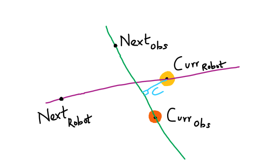

If the distance between the current and next positions of the obstacle is too large, the same step can be broken down into multiple points and then for each of those points the above three conditions can be applied to check for collision. 

Now that we have figured out how to check for collisions with dynamic obstacles, we move on the re-planning step. 
Let’s say there is a collision with a dynamic obstacle. The main thread issues a replanning step. The re-planning algorithm is implemented as follows. 


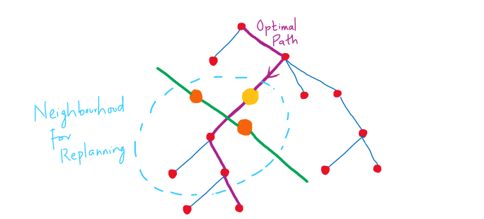


After setting up the neighborhood around the robot’s position, an assumption had to be made to simplify the process of reaching to the final goal location. The assumption is that the robot is currently on the optimal path towards the goal location and should return to this same path, after navigating around the dynamic obstacle. The node on the optimal path immediately following the node that is closest to the obstacle, without colliding, will be the replanned local goal. The following figures illustrate the idea. 

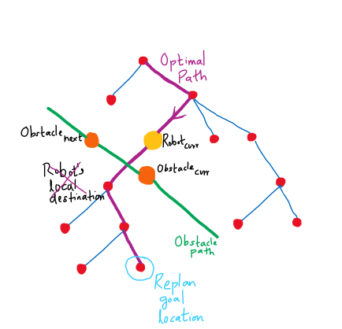

 
As shown above, once the replan local goal location is decided, a rewiring and RRT* (discussed previously) is executed to find a path to the re-planned goal. 

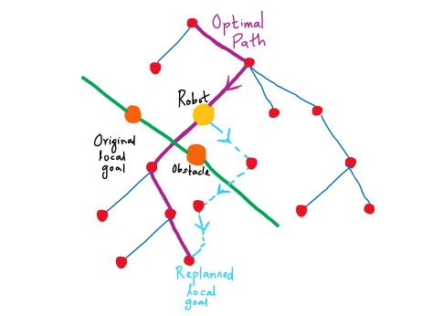
 
Once a new path to the re-planned local goal is found, the current optimal path between the robot’s location and replanned local goal location is invalidated. Instead, the new path shown in Blue is added to the optimal path. The rest of the optimal path post the replanned goal node stays the same. 

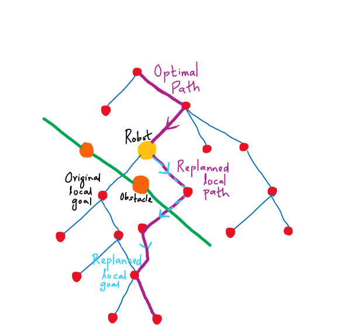

When the robot reaches the re-planned goal location, the execution of the original optimal path resumes. Whenever the robot encounters the dynamic obstacle, the replanning algorithm is executed and the replan goal location will always stay on the optimal path to the global goal. 
The simulation results demonstrate the robot’s ability to re-plan a path around any dynamic obstacle and reach the goal. 
 
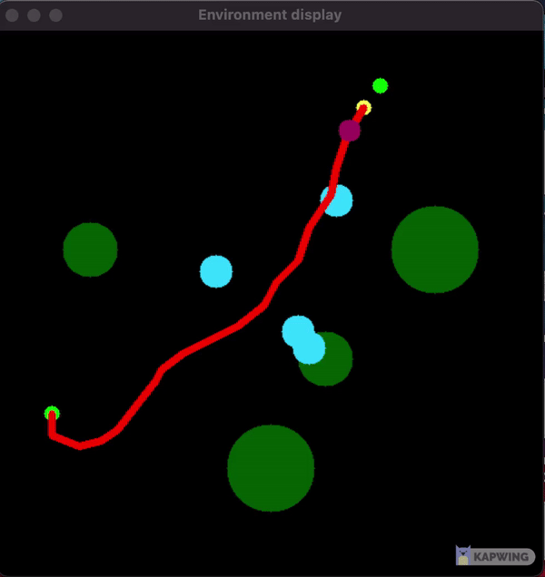 
