We will first discuss how RRT operates. The algorithm starts by building a tree using random samples from the robot’s operating space and adds new samples to the tree. Below is the pseudo code for RRT. Each step is discussed in detail later. 

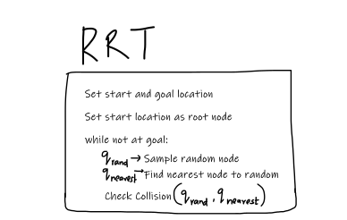

The algorithm begins by setting up the start and goal location. A root node is created from the start location. The configuration space for this application is the 3D space in which the robot operates. So, each node in the RRT algorithm is nothing but points in 3D. 

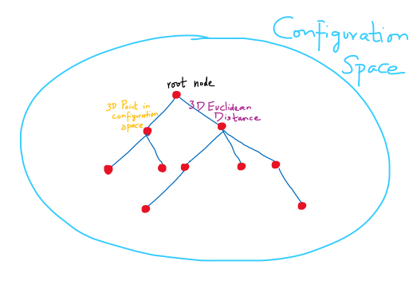
 
A nearest node is selected from the existing tree as the potential parent of the randomly sampled node. 

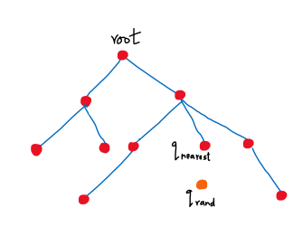
 
The following indicates the potential path that connects the nearest and randomly sampled node. 

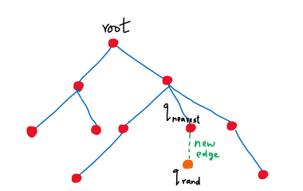

Next, the new edge is checked for collision with obstacles. It is not only important to consider physical blocking of the path with obstacle, but also consider if the robot might collide while moving on the new edge between the nearest and randomly sampled node. The pseudo code for check collision is shown here. There are three main steps:
1.	Check if random sampled node is inside an obstacle 
2.	Check if the new edge collides with an obstacle 
3.	Check if the robot pose is free from collision for the newly added edge 

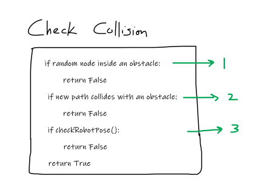
 

An illustration of step# 1 from above is below. If the random sampled node is inside an obstacle, it is NOT considered to be added to the tree. 

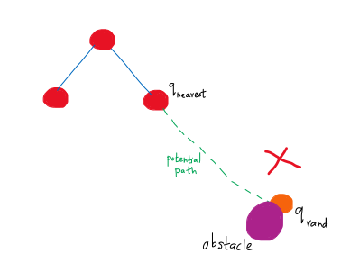

If condition# 1 passes, the potential edge from nearest to the sampled node is check for any collision. 

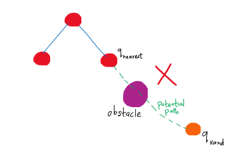

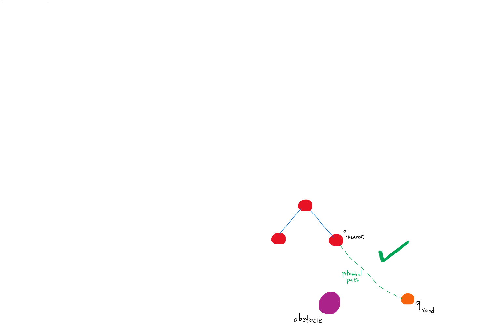

If both above conditions pass, the robot pose is checked against collisions with the obstacles. First, we will take a look at the robot. For this application, a 3-joint robot is considered. All the joints of the robot are rotational with the first joint having a rotational axis along vertical direction while the other two joints have their rotational axis in the horizontal direction. 

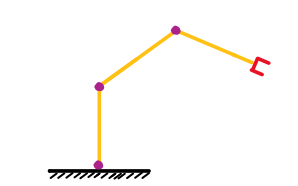

The new edge is divided into multiple points where the pose of the robot is estimated and collision with the obstacles is checked. 
 

Just as an example, consider the below poses where the robot is obstructed from the obstacle while travelling from the nearest to the random node. 
 
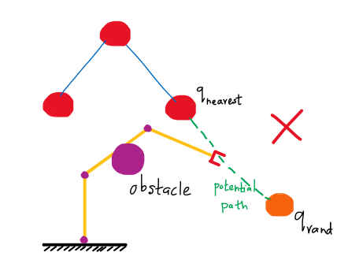

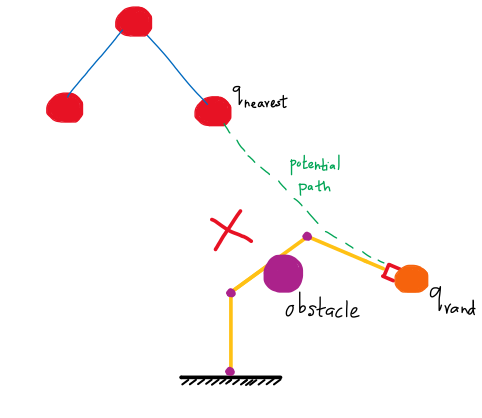

If the robot poses don’t collide with the obstacle for all the sampled points on new edge, the condition# 3 in the collision check algorithm is passed and hence, the newly sampled random node is added to the tree. The tree keeps expanding in similar manner till it approaches the goal node. 
The simulation below shows the start and goal nodes are represented by small blue spheres and the larger red spheres represent obstacles. The robot starts from ‘start node’ and navigates through the configuration space, on an optimal path found out by RRT. The brown colored ‘X’ marks represent the robot’s joints. As can be clearly seen in the GIF, the optimal path avoids interference of the robot with all obstacles. 

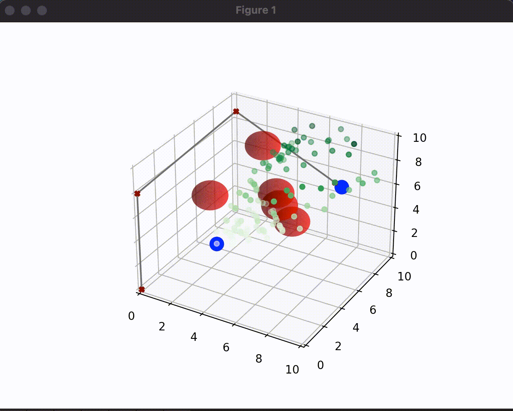 

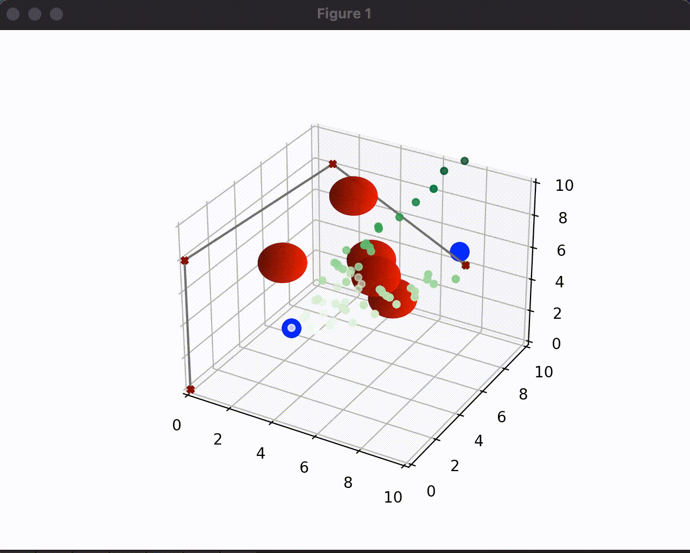 
